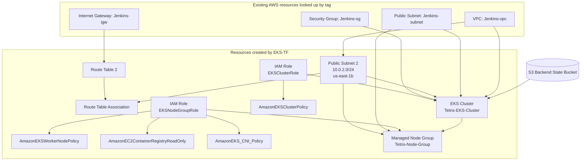

# EKS-TF

This Terraform folder creates an Amazon EKS cluster and a managed node group on top of network resources that already exist in AWS.

The most important thing to know is that this folder is only partially self-contained. It does not create the main VPC, internet gateway, first subnet, or security group. Instead, it looks them up by tag name and reuses them, then adds a second subnet, a route table for that subnet, IAM roles, the EKS control plane, and the managed worker nodes.

## What This Terraform Creates

- One new public subnet in `us-east-1b`
- One route table for that subnet
- One route table association
- One IAM role for the EKS control plane
- One IAM role for the EKS worker nodes
- Four managed IAM policy attachments
- One EKS cluster
- One managed EKS node group

## What Must Already Exist

- An S3 bucket for the remote backend: `dev-aman-tf-bucket`
- A VPC tagged as `Jenkins-vpc`
- An internet gateway tagged as `Jenkins-igw`
- A subnet tagged as `Jenkins-subnet`
- A security group tagged as `Jenkins-sg`

Those existing resources are referenced through Terraform `data` sources in [vpc.tf](/c:/Users/erjen/Desktop/PROJECTS/DevSecOps-project/End-to-End-Kubernetes-DevSecOps-Tetris-Project/EKS-TF/vpc.tf).

## How It Works

1. Terraform reads the existing VPC, internet gateway, subnet, and security group by tag name.
2. It creates a second public subnet in a different Availability Zone.
3. It creates a route table and associates it with that new subnet so internet access works there too.
4. It creates IAM roles for the EKS control plane and the worker nodes.
5. It attaches the AWS-managed policies EKS needs.
6. It creates the EKS control plane across the existing subnet and the newly created subnet.
7. It creates a managed node group that launches EC2 worker nodes into both subnets.

## Architecture Diagram

## Resource Relationship Summary

- `vpc.tf` reuses the shared network and only adds the second subnet pieces.
- `iam-role.tf` defines who is allowed to assume the EKS roles.
- `iam-policy.tf` grants the exact AWS-managed permissions EKS and its nodes need.
- `eks-cluster.tf` creates the Kubernetes control plane.
- `eks-node-group.tf` creates the worker nodes that run your pods.

## Important Notes

- The cluster uses public subnets, so worker nodes are launched into publicly routable networks.
- The cluster depends on another stack or manually created resources being tagged exactly as listed in `variables.tfvars`.
- Some variables such as `iam-role-eks` and `iam-role-node` are informational right now; the actual IAM role resource names are still hard-coded in the Terraform.
