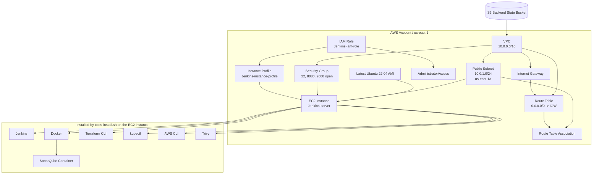

# Jenkins-Server-TF

This Terraform folder builds the base AWS environment for a Jenkins server and bootstraps the EC2 instance with a full DevSecOps toolchain.

At a high level, it creates a VPC, internet gateway, public subnet, route table, security group, IAM role, instance profile, and one EC2 instance. When that instance boots, the `tools-install.sh` script installs Jenkins, Docker, SonarQube, Terraform, `kubectl`, AWS CLI, and Trivy.

## What This Terraform Creates

- One VPC: `10.0.0.0/16`
- One internet gateway
- One public subnet: `10.0.1.0/24` in `us-east-1a`
- One route table with a default route to the internet
- One route table association
- One security group
- One IAM role for the EC2 instance
- One IAM policy attachment with `AdministratorAccess`
- One IAM instance profile
- One EC2 instance for Jenkins
- One Ubuntu 22.04 AMI lookup through a Terraform data source

## How It Works

1. Terraform creates the VPC and attaches an internet gateway.
2. It creates a public subnet and associates a route table that sends outbound traffic to the internet gateway.
3. It creates a security group that opens ports `22`, `8080`, and `9000` to the internet.
4. It looks up the latest Ubuntu 22.04 AMI from Canonical.
5. It creates an IAM role and wraps it in an instance profile so the EC2 instance can use AWS permissions.
6. It launches one EC2 instance into the public subnet.
7. During the first boot, `user_data` runs `tools-install.sh` to install the Jenkins and DevSecOps tooling.

## Architecture Diagram

## Resource Relationship Summary

- `vpc.tf` builds the network and the security group.
- `gather.tf` fetches the latest Ubuntu image to avoid hard-coding an AMI ID.
- `iam-role.tf`, `iam-policy.tf`, and `iam-instance-profile.tf` prepare AWS permissions for the EC2 instance.
- `ec2.tf` launches the instance and bootstraps the software stack with `user_data`.

## Important Notes

- The security group opens Jenkins, SonarQube, and SSH to `0.0.0.0/0`, which is convenient for a demo but risky for production.
- The IAM role receives `AdministratorAccess`, which is also suitable for a lab only and should be narrowed down in a real environment.
- The backend bucket `dev-aman-tf-bucket` must already exist before `terraform init` can succeed.

---how to run---

terraform init
terraform plan -var-file="variables.tfvars"
terraform apply -auto-approve -var-file="variables.tfvars"

--in linux--
install and verufy all resorces are created and run or not = ss -tlpn { use to check all the ports are open or not }

then install plugis
-aws credentials plugin
-stage view plugin
-aws steps plugin
-rebuild plugin

then configure the aws credentials in jenkins
== to check the secreat and access key =; cat ~/.aws/credentials

then create the job and then deploy a eks cluster using jenkins and then deploy the source code on eks cluster using jenkins
